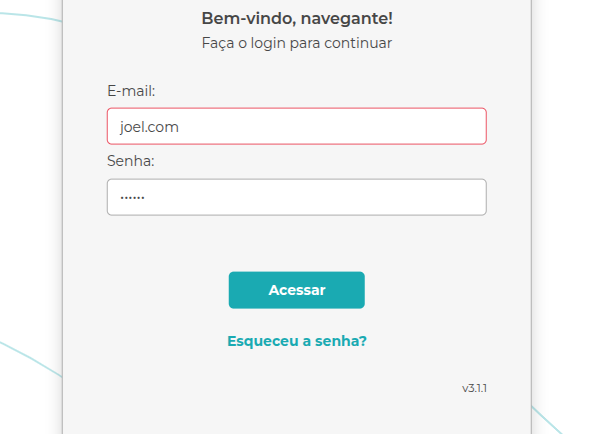

# Template de Bug

Arquivo: `/Bug/template-bug-report.md`

**Bug:** Botão “Acessar” não exibe foco visual ao ser selecionado com TAB.

**Descrição:**

Durante o teste de acessibilidade na tela de login, foi identificado que o botão “Acessar” não possui um visual com foco quando o usuário navega pela tecla TAB.  
Foi observado que ao passar o cursor do mouse, o botão muda de cor, mostrando que o foco existe mas funciona somente assim.

**Cenário de Reprodução:**

1. Acessar a tela de login pela url `https://qa.navega.com.vc/login`
2. Pressionar a tecla "TAB" três vezes até o botão “Acessar” receber o foco
3. Observar que o botão "Acessar" não exibe contorno de foco.

**Resultado Atual:**

O botão "Acessar" não exibe o foco quando navega com a tecla TAB.

**Resultado Esperado:**

Ao clicar na tecla TAB três vezes, o botão "Acessar" deve ficar com foco e com um azul mais escuro. (Comportamento já ocorre ao colocar a seta do mouse em cima do botão Acessar)

**Evidência:**

Com a tecla TAB não fica focado

Com a seta do mouse fica focado

**Hipótese Técnica:**

**Ambiente**: https://qa.navega.com.vc/login

**Versão:** v3.1.1

**Sistema Operacional:** Ubuntu 22.04

**Navegador:** Google Chrome 142.0
'