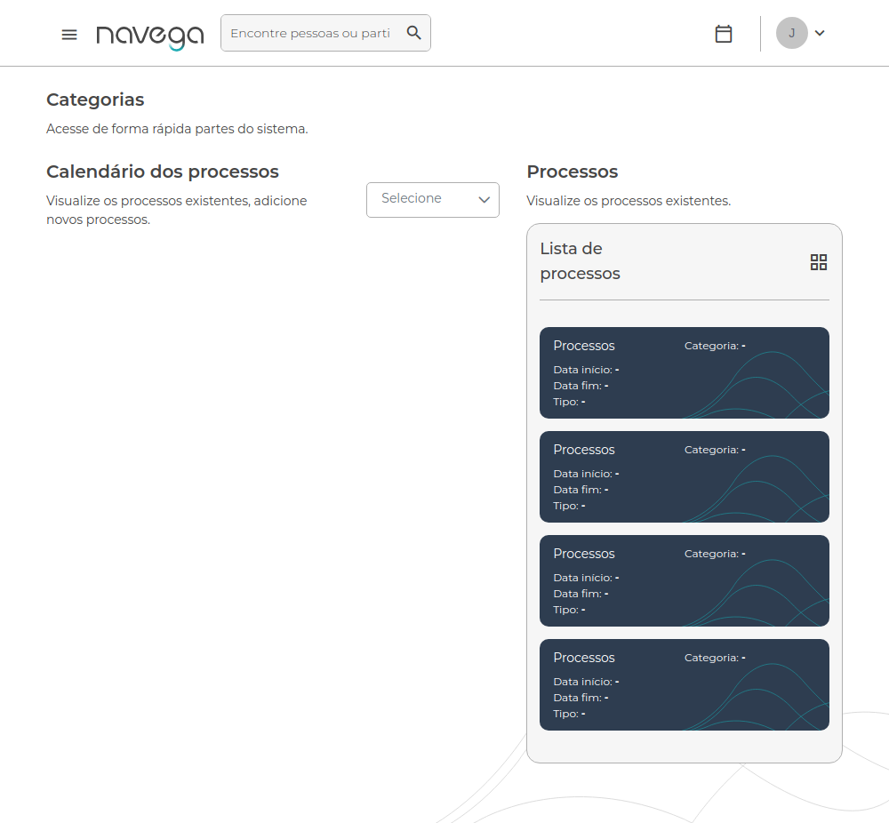
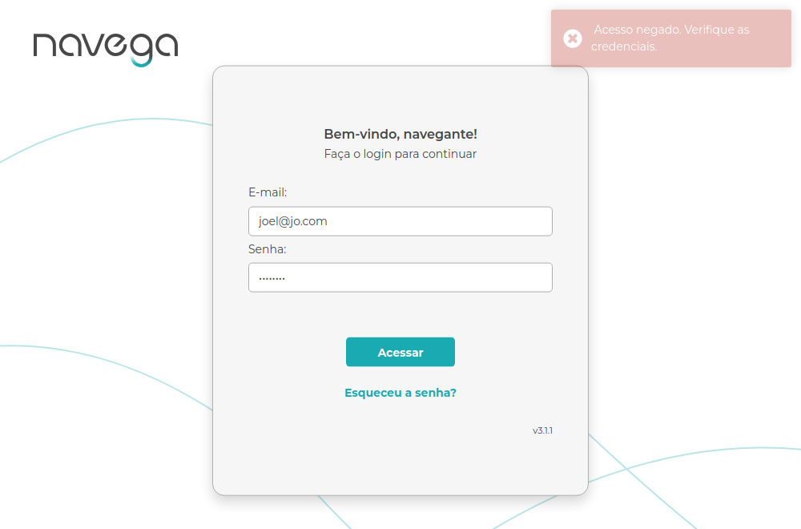
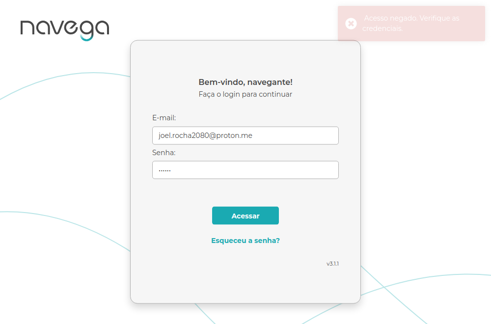
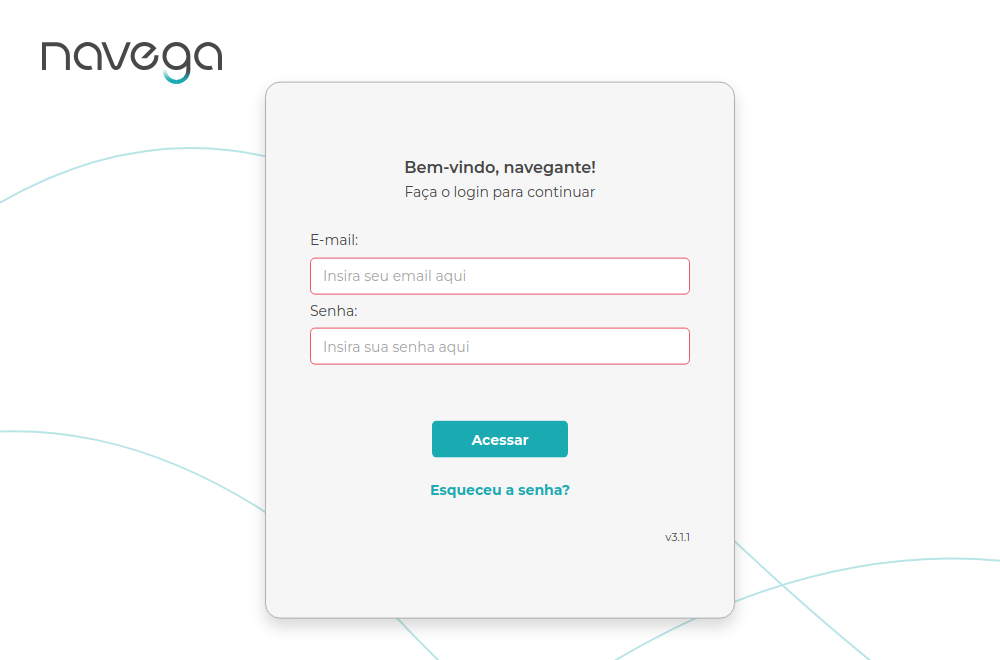
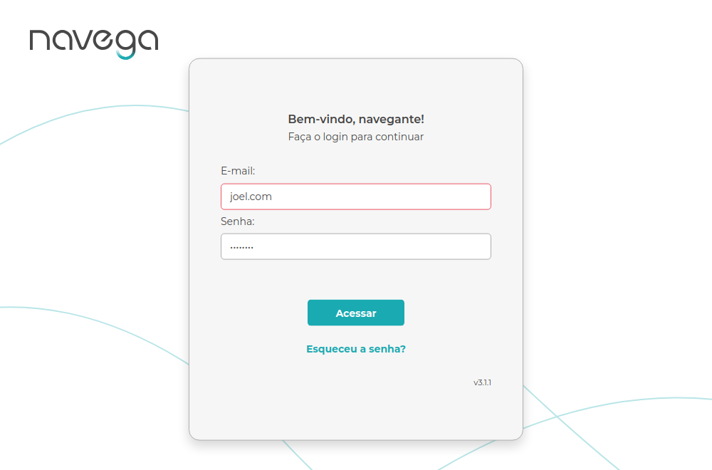
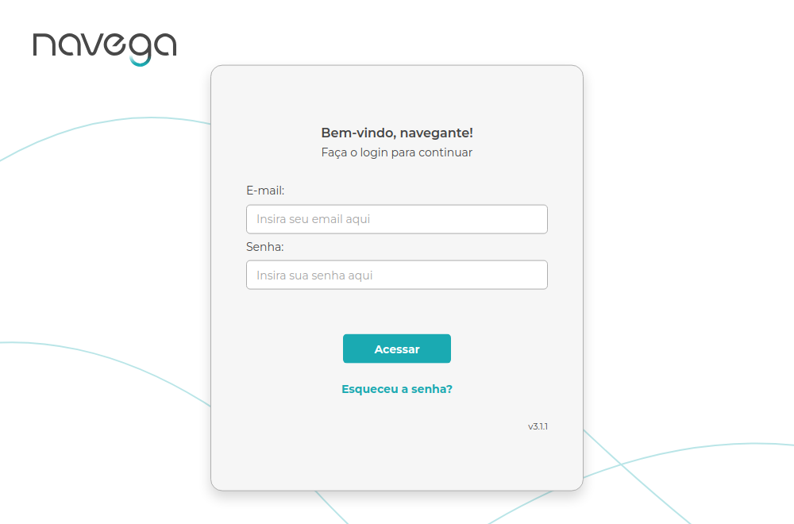

# Template de Caso de Teste

Arquivo: `/CasosDeTeste/template-caso-de-teste.md`

| ID | Cenário | Pré-condições | Passos | Resultado Esperado | Resultado Obtido | Prioridade |
|----|----------|----------------|---------|--------------------|------------------|-------------|
| CT-LOGIN-001 | Login com credenciais válidas | Usuário ativo e senha válida | 1. Acessar a página de login do Navega<br>2. Preencher e-mail válido no campo E-mail<br>3. Preencher senha válida no campo Senha<br>4. Clicar no botão "Acessar" | Redireciona para a página inicial do site Navega exibindo o menu principal | O usuário foi redirecionado para a página inicial do site Navega ao logar com credenciais válidas | P0 |
| CT-LOGIN-002 | Login com e-mail incorreto | Preencher e-mail incorreto | 1. Acessar a página de login do Navega<br>2. Informar e-mail incorreto (ex: `joel@jo.com`)<br>3. Inserir senha correta<br>4. Clicar no botão "Acessar" | Mensagem de erro é exibida: "Acesso negado. Verifique as credenciais." | A mensagem de erro é exibida quando usuário tenta logar com e-mail incorreto | P0 |
| CT-LOGIN-003 | Login com senha incorreta | Preencher senha incorreta | 1. Acessar a página de login do Navega<br> 2. Inserir E-mail válido<br>3. Inserir senha incorreta<br>4. Clicar no botão "Acessar" | Exibir mensagem de erro: "Acesso negado. Verifique as credenciais." | A mensagem de erro é exibida quando usuário tenta logar com senha incorreta | P0 |
| CT-LOGIN-004 | Login com campos vazios | Deixar os campos vazios e clicar no botão "Acessar" | 1. Acessar a página de login do Navega<br>2. Deixar os campos de e-mail e senha em branco<br>3. Clicar no botão "Acessar" | Os campos e-mail e senha devem ficar com bordas vermelhas | Os campos ficam com borda vermelha quando usuário deixa os campos de e-mail e senha vazios | P1 |
| CT-LOGIN-005 | Login com e-mail inválido | Preencher e-mail inválido (ex: e-mail sem @, sem .com) | 1. Acessar a página de login do Navega<br>2. Inserir e-mail inválido (ex: `joel.com`)<br>3. Inserir senha correta | O campo e-mail deve ficar com borda vermelha | O campo de e-mail fica com borda vermelha quando usuário insere e-mail inválido| P0 |
| CT-LOGIN-006 | Logout | Usuário deve está logado | 1. Clicar no menu<br>2. Selecionar opção "Sair" | Redirecionar o usuário à tela de login do site Navega | Usuário desloga com sucesso e é redirecionado para a página de login | P1 |
| CT-LOGIN-007 | Foco nos campos e botão Acessar ao navegar com TAB  | Navegar com a tecla TAB | 1. Acessar a página de login do Navega<br>2. Navegar com TAB entre os campos e botão "Acessar"<br>3. Observar foco nos campos e no botão "Acessar" | Campos e botões devem ter foco visível | **Falha**- Botão "Acessar" está sem foco ao navegar com a tecla TAB | P2 |


### Padrão BDD
```
Funcionalidade: Login

Cenário 1: Usuário realiza login com sucesso

  Dado que o usuário acessa a tela de login
  E preenche o campo E-mail com um e-mail válido
  E preenche o campo Senha com a senha correta
  Quando clica no botão "Acessar"
  Então deve ser redirecionado para a página inicial do site Navega
  E deve visualizar o menu principal

---

Cenário 2: Usuário tenta logar com e-mail incorreto

  Dado que o usuário acessa a tela de login
  E insere um e-mail incorreto no campo E-mail
  E preenche uma senha correta
  Quando clica no botão "Acessar"
  Então deve visualizar a mensagem "Acesso negado. Verifique as credenciais."
  E deve permanecer na tela de login

---

Cenário 3: Usuário tenta logar com senha incorreta

  Dado que o usuário acessa a tela de login
  E preenche o campo E-mail com e-mail válido
  E insere uma senha incorreta
  Quando clica no botão "Acessar"
  Então deve visualizar a mensagem "Acesso negado. Verifique as credenciais."

---

Cenário 4: Usuário tenta logar sem preencher os campos

  Dado que o usuário acessa a tela de login
  Quando deixa os campos E-mail e Senha vazios
  Então os campos e-mail e senha deve ficar com bordas vermelhas

---

Cenário 5: Login com e-mail inválido

  Dado que o usuário acessa a tela de login
  Quando insere um e-mail inválido sem o @
  E preenche uma senha correta
  Então o campo e-mail deve ficar com borda vermelha
  E deve permanecer na tela de login

---

Cenário 6: Fazer Logout do site Navega

  Dado que o usuário está logado no site do Navega
  E clicar no menu superior
  Quando selecionar a opção "Sair"
  Então deve ser redirecionado para a página de login do site Navega

---

Cenário 7: Foco nos campos e botão Acessar ao navegar com TAB

  Dado que o usuário acessa a tela de login
  E clica na tecla TAB
  Quando clicar três vezes na tecla TAB
  Então deve ver o foco no botão "Acessar"

```

#### CT-LOGIN-001 - Login com credenciais válidas


#### CT-LOGIN-002 - Login com e-mail incorreto


#### CT-LOGIN-003 - Login com senha incorreta

#### CT-LOGIN-004 - Login com campos vazios

#### CT-LOGIN-005 - Login com e-mail inválido (sem @)

#### CT-LOGIN-006 - Logout do usuário logado

### Evidência em vídeo
Vídeo: [login.cy.js.mp4](../Automation/cypress/videos/login.cy.js.mp4)